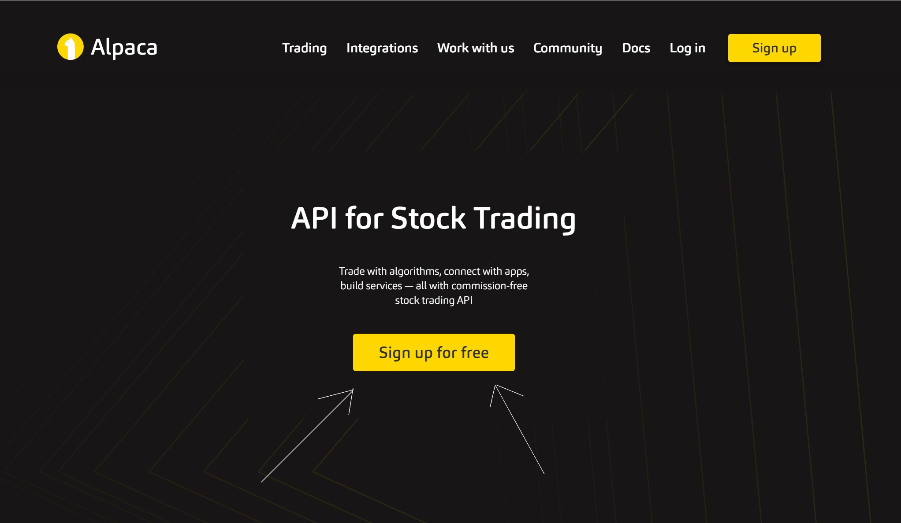
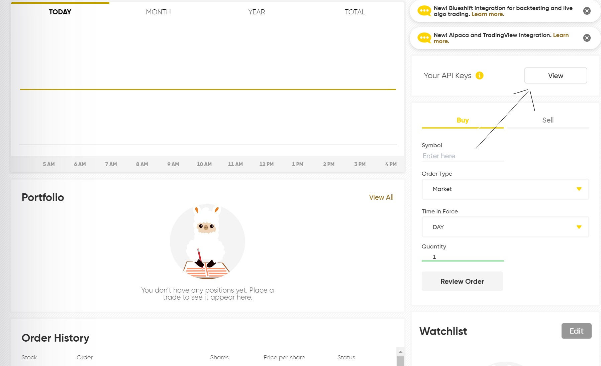
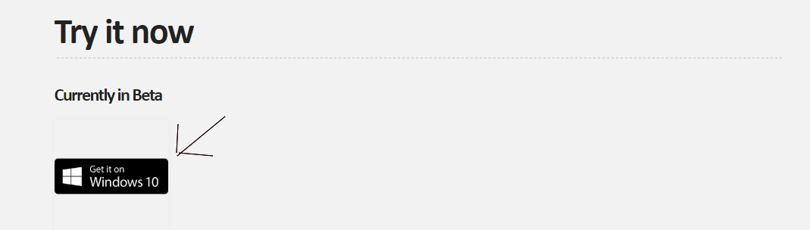

# Simple Automated Investing for All
<!-- Global site tag (gtag.js) - Google Analytics -->

 

As trading evolves along with technology, automated algorithmic trading is becoming essential in maximizing day trading gains. Large quantative trading firms and hedge funds already have their own algorithms making them money everyday. Its time for you to be able to do the same.

<h2> Try it now </h2>
<h6> Currently in Beta </h6>

 
<h2> How to Use </h2>
 
1. Create an Account at Alpaca.markets so you can trade with either paper money or real money.  

 
2. Reveal your API keys 

 
3. Download our automated assistant and run  

 
4. Follow the Command line prompts prompting you for your Alpaca ID and secret key  

 
5. The Script is now running and should update you on your positions and balance periodically until the NYSE and Nasdaq close for the day  
 
<h2> Stocks Traded </h2>
This program currently only trades 4 different stocks (FB, AMZN, GOOG, MSFT) and checks them on a secondly basis, deciding if it should buy, sell, hold or pass. 
 
<h2> More Information </h2>
<h6> <a href="TechnologySpecs.md">Tech Specs</a> </h6>
<h6> <a href="Support.md">Contact Support</a>   </h6>
